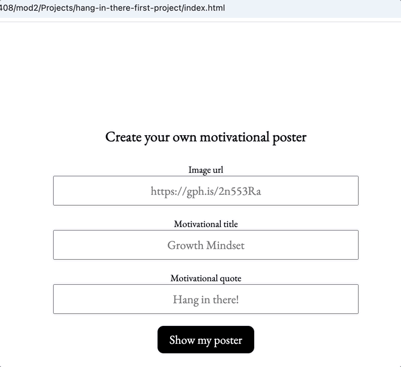

# Hang in There  

### Abstract:
[//]: <> Webpage to display and create motivational posters! It also has Unmotivational posters for fun and can be deleted.

### Installation Instructions:
[//]: <> Fork and then clone repo down to your local machine. In the terminal of VS Code, type "open index.html" This will open a webpage and that is it!

### Preview of App:
[//]: <> 

### Context:
[//]: <> I had a little over a week to complete this project and I am currently in Mod 2.

### Contributors:
[//]: <> https://github.com/bwillett2003 https://www.linkedin.com/in/bryan--willett/

### Learning Goals:
[//]: <> The learning goals for this project were: Build out functionality using functions that show trends toward SRP. Manipulate the page after it has loaded by adding, removing, and updating elements on the DOM. Use array prototype iterator methods to reformat data and display it on the DOM. Use CSS and HTML to match styling and layout of provided comps. The only tech I used during this project was VSCode, Github, Slack, and ChatGPT.

### Wins + Challenges:
[//]: <> It has functionality! That is always a win. I added an alert to the create poster field that pops up a message to fill out all fields before submitting. Simple but really fun and helpful. The challenges were dealing with saving and deleting posters. I overcame this by just researching different ways to eventually find a solution.
